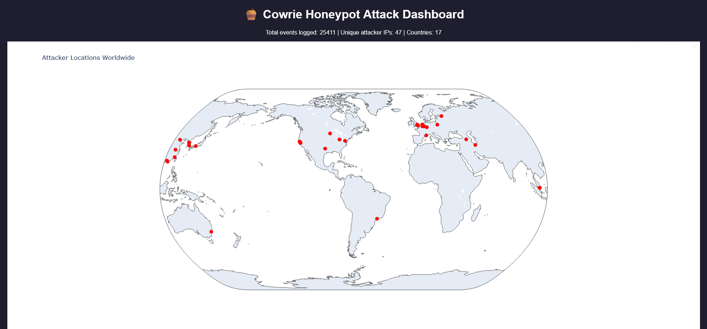
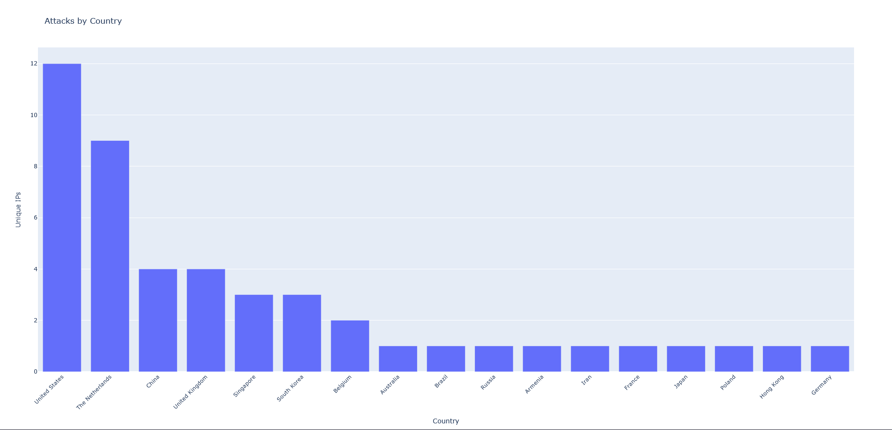
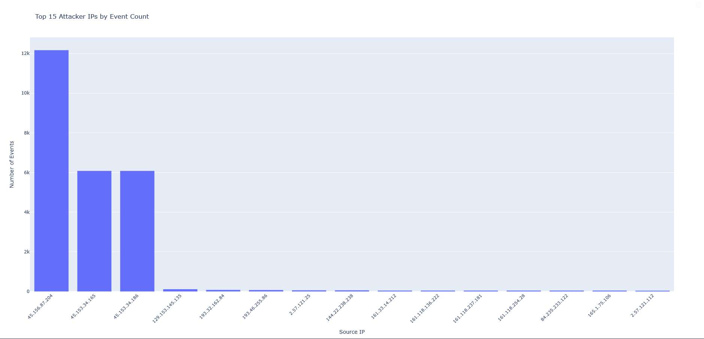
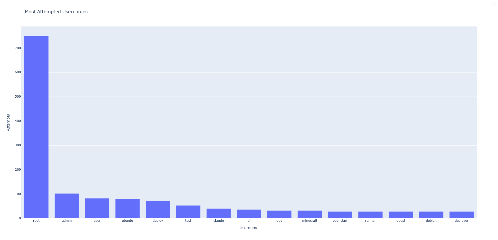
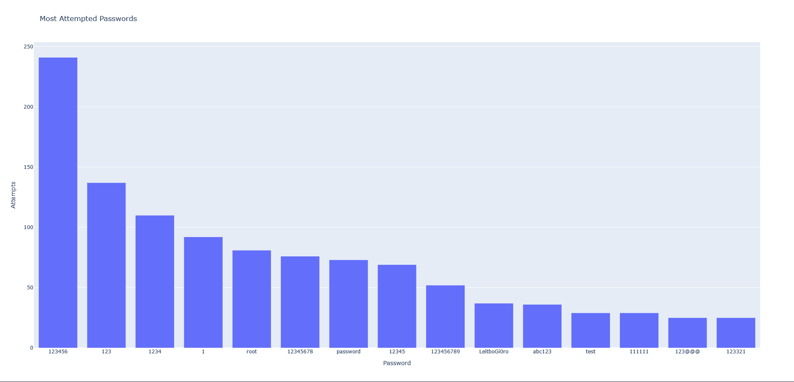
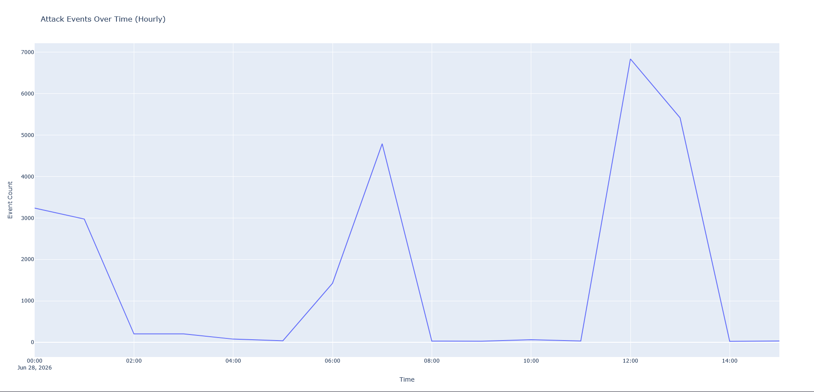

# 🍯 Cowrie SSH Honeypot + Attack Dashboard

A honeypot project that deploys a fake SSH server to attract real-world attacker traffic, then visualizes the captured data in an interactive dashboard.

## Overview

This project deploys [Cowrie](https://github.com/cowrie/cowrie), a medium-interaction SSH/Telnet honeypot, on an Oracle Cloud VM. The honeypot simulates a vulnerable Linux server, logging every login attempt, command, and connection from real attackers and bots scanning the internet. Captured data is parsed, enriched with geolocation, and visualized in an interactive HTML dashboard.

## Architecture

Internet attackers/bots

|

v

Oracle Cloud VM (Ubuntu 22.04)

Port 22 (iptables NAT redirect) -> Port 2222 (Cowrie)
Port 2200 (real SSH, admin access only)

|

v

Cowrie honeypot (fake SSH server, JSON logging)

|

v

Python pipeline (parse_logs.py)
Parses JSON logs into SQLite
Enriches attacker IPs with GeoIP lookup (ip-api.com)

|

v

Dashboard (build_dashboard.py)
Plotly-generated interactive HTML report

## Results

- **25,411** total logged events
- **47** unique attacker IPs
- **20+** countries represented
- Multiple credential-stuffing attempts, a pivot/relay attempt, and protocol-confusion probes captured

## Key Findings

- Several source IPs sharing an identical SSH client fingerprint ("hassh") strongly suggest a single coordinated botnet operating across rotating IPs/cloud providers rather than independent actors.
- Multiple attackers attempted to use the compromised session as a relay (`direct-tcpip` requests), a common technique for using a victim machine as a proxy/pivot point.
- One connection attempt sent a malformed HTTP request instead of an SSH handshake — likely a bot mistakenly probing the wrong port.

**Note:** Source IPs represent the network origin of each connection, not necessarily the attacker's true physical location — many correspond to cloud hosting providers or VPN infrastructure commonly used to obscure origin.

## Dashboard Screenshots

### Attacker Locations Worldwide

### Attacks by Country

### Top Attacker IPs

### Most Attempted Usernames

### Most Attempted Passwords

### Attack Volume Over Time

## Tech Stack

- **Cowrie** — SSH/Telnet honeypot
- **Oracle Cloud (Always Free Tier)** — hosting
- **iptables** — port redirection (22 -> 2222) and access control
- **Python** — pandas, sqlite3, requests
- **SQLite** — structured event storage
- **ip-api.com** — free GeoIP lookups
- **Plotly** — interactive dashboard visualizations

## What I Learned

- Setting up and securing cloud infrastructure (SSH key auth, firewall rules at both the cloud provider and OS level, iptables NAT/INPUT chain ordering)
- How real-world automated attack traffic behaves: credential-stuffing patterns, botnet fingerprinting via SSH client signatures, pivot/relay attempts
- Building a full data pipeline from raw logs to structured data to visualization
- Debugging multi-layered network configurations (cloud firewall + OS firewall + iptables all needing separate rules for the same port)

## Running This Yourself

1. Deploy Cowrie on a cloud VM (see [Cowrie docs](https://github.com/cowrie/cowrie))
2. Pull logs: `scp` the `cowrie.json` log file locally
3. `pip install pandas plotly requests`
4. Run `python3 parse_logs.py` to build the SQLite database
5. Run `python3 build_dashboard.py` to generate `honeypot_dashboard.html`
6. Open the HTML file in any browser
